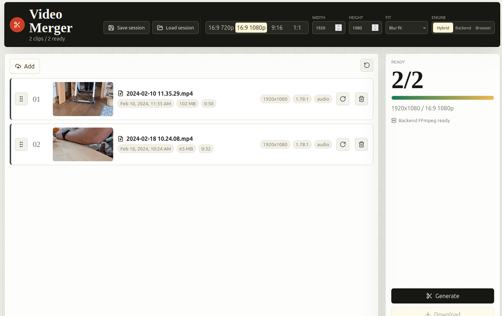
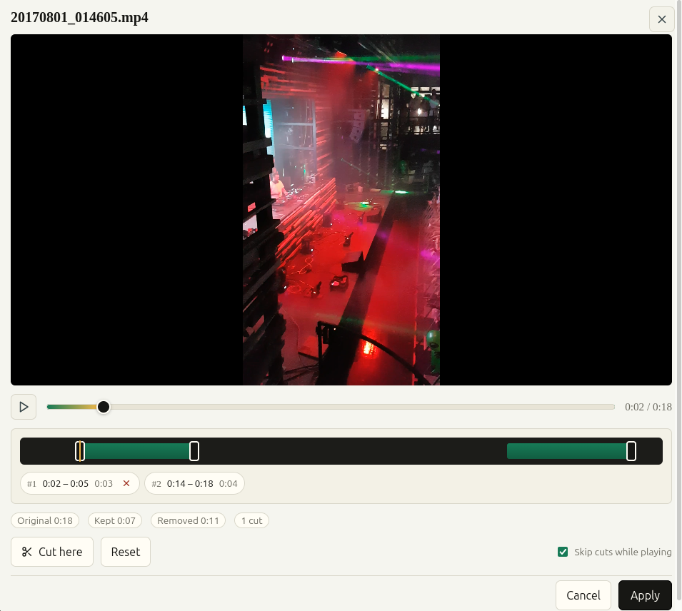

<div align="center">

# Video Merger

A browser-first MP4 merger built with Vite, React, TypeScript, `@dnd-kit`, and `ffmpeg.wasm`. Drop in your clips, reorder them on a timeline, trim segments, and export a single MP4 — all without leaving your browser.

<br />

[](https://github.com/johannesWen/Video-Merger/releases)
[](https://github.com/johannesWen/Video-Merger/blob/main/LICENSE)
[](https://github.com/johannesWen/Video-Merger/issues)
[](https://github.com/johannesWen/Video-Merger/stargazers)
[](https://github.com/johannesWen/Video-Merger/network)

[](https://www.typescriptlang.org/)
[](https://react.dev/)
[](https://vitejs.dev/)
[](https://ffmpegwasm.netlify.app/)
[](https://nodejs.org/)

</div>

---

## Preview

<div align="center">

### Main Timeline



### Edit & Trim Dialog



</div>

---

## Table of Contents

- [Features](#features)
- [Demo](#demo)
- [Tech Stack](#tech-stack)
- [Architecture](#architecture)
- [Installation](#installation)
- [Getting Started](#getting-started)
- [Usage](#usage)
- [Engine Modes](#engine-modes)
- [Scripts](#scripts)
- [Project Structure](#project-structure)
- [Roadmap](#roadmap)
- [Contributing](#contributing)
- [License](#license)
- [Acknowledgements](#acknowledgements)

---

## Features

- **Drag & Drop Upload** – Add multiple video files (`.mp4`, `.mov`, `.webm`, `.mkv`) via picker, drop zone, or paste.
- **Smart Auto-Sort** – Clips are automatically ordered by file modification time.
- **Clip Inspector** – See duration, resolution, aspect ratio, and audio stream info per clip.
- **Sortable Timeline** – Reorder clips with mouse or keyboard via `@dnd-kit`.
- **Trim Segments** – Cut in/out points on any clip before merging.
- **Split Clip** – Split a clip into two independent clips at the playhead.
- **Duplicate & Rename** – Duplicate any clip, or double-click its name to rename it.
- **Undo / Redo** – Step back and forward through timeline edits (`Ctrl/Cmd+Z`, `Ctrl/Cmd+Shift+Z`).
- **Per-Clip Volume & Mute** – Adjust or silence individual clips.
- **Per-Clip Speed** – Slow down or speed up a clip from 0.5x–2x.
- **Fade In / Out** – Add audio+video fades per clip.
- **Color Adjustment** – Brightness, contrast, and saturation per clip.
- **Watermark Overlay** – Burn in a logo image at any corner or center, with adjustable opacity.
- **Background Music** – Mix in a looping music track under the merged audio.
- **GIF Export** – Convert the merged result to an animated GIF.
- **Flexible Output** – Choose from common output aspect ratios (16:9, 9:16, 1:1) plus ready-made social presets (Instagram Reel, TikTok, YouTube Shorts, Instagram Story, Square Post).
- **Aspect Ratio Fit** – Mismatched source frames are placed over a blurred background to fill the canvas.
- **Audio Normalization** – Clips without audio receive a silent AAC track so mixed projects merge cleanly.
- **Hybrid Engine** – Falls back to native backend FFmpeg for larger projects; browser FFmpeg for everything else.
- **Autosave & Restore** – Project settings are autosaved locally; reload the app and restore/relink clips.
- **Live ETA** – See an estimated time remaining while merging.
- **Error Log Export** – Download a text log of everything that went wrong during a session.
- **Keyboard Shortcuts Cheat Sheet** – Press `?` for a quick reference.
- **Light & Dark Theme** – Toggle from the toolbar; respects your OS preference by default.
- **100% Private** – Files are processed locally in the browser by default. Nothing is uploaded to a server unless you opt into backend mode.
- **Modern UI** – React 18 + Lucide icons, accessible keyboard interactions.

---

## Demo

1. Clone the repo and run the dev server (see [Installation](#installation)).
2. Open `http://localhost:5173`.
3. Drop a few `.mp4` files into the upload area.
4. Reorder / trim as needed.
5. Pick an output ratio and click **Merge**.

Sample clips are available in the `examples/` directory (git-ignored) for quick testing.

---

## Tech Stack

| Layer            | Technology                                |
| ---------------- | ----------------------------------------- |
| UI Framework     | [React 18](https://react.dev/)            |
| Build Tool       | [Vite 6](https://vitejs.dev/)             |
| Language         | [TypeScript 5](https://www.typescriptlang.org/) |
| Drag & Drop      | [`@dnd-kit`](https://dndkit.com/)         |
| Browser Engine   | [`@ffmpeg/ffmpeg`](https://ffmpegwasm.netlify.app/) (WebAssembly) |
| Backend Engine   | Native [`ffmpeg`](https://ffmpeg.org/) / `ffprobe` via Express |
| HTTP Server      | [Express 5](https://expressjs.com/)       |
| File Uploads     | [`multer`](https://github.com/expressjs/multer) |
| Icons            | [`lucide-react`](https://lucide.dev/)     |
| Testing          | [Vitest](https://vitest.dev/) + jsdom     |
| Concurrency      | [`concurrently`](https://github.com/open-cli-tools/concurrently) |

---

## Architecture

```
┌────────────────────────┐         ┌──────────────────────────┐
│  React Frontend (Vite) │  /api   │  Express Backend (Node)  │
│  localhost:5173        │ ──────► │  localhost:5174          │
│                        │         │                          │
│  • Drag & Drop UI      │         │  • Upload endpoint       │
│  • Timeline / Trimmer  │         │  • FFmpeg/ffprobe probe  │
│  • Browser FFmpeg.wasm │         │  • Native merge fallback │
└────────────────────────┘         └──────────────────────────┘
```

The UI is engine-agnostic. A small `MergeEngine` interface lets the app swap between:

- **`BrowserFfmpegEngine`** – `ffmpeg.wasm` running in a Web Worker. Always available, no install needed.
- **`BackendFfmpegEngine`** – Native `ffmpeg` on the Node backend. Faster for large projects.
- **Hybrid (default)** – Picks the best engine per project size and backend availability.

---

## Installation

### Prerequisites

- **Node.js** `>= 20.x` (tested on 24.x)
- **npm** `>= 10.x`
- **FFmpeg** (optional, for the backend engine)

### Clone

```bash
git clone https://github.com/johannesWen/Video-Merger.git
cd Video-Merger
```

### Install dependencies

```bash
npm install
```

### (Optional) Install native FFmpeg

The browser engine works out of the box. To enable the faster backend engine:

```bash
# Debian / Ubuntu
sudo apt install ffmpeg

# macOS
brew install ffmpeg

# Windows
choco install ffmpeg
```

Verify with:

```bash
ffmpeg -version
ffprobe -version
```

---

## Getting Started

### Quick start scripts

Cross-platform launcher and build scripts are included so you don't need to remember npm commands:

| Platform        | Start dev servers | Build for production |
| --------------- | ------------------ | --------------------- |
| Windows         | `start.bat`         | `build.bat`            |
| macOS           | `start.command`     | `build.command`        |
| Linux / macOS   | `./start.sh`        | `./build.sh`           |

Each script checks for Node.js, runs `npm install` if `node_modules` is missing, and then starts the dev servers or produces a production build in `dist/`.

Start both the frontend and backend dev servers in one command:

```bash
npm run dev
```

This uses `concurrently` to run:

| Service  | URL                      | Description                                      |
| -------- | ------------------------ | ------------------------------------------------ |
| Frontend | <http://localhost:5173>  | The React app (Vite dev server)                  |
| Backend  | <http://localhost:5174>  | Express API for uploads and native FFmpeg jobs   |

The Vite dev server automatically sets the `Cross-Origin-Opener-Policy` and `Cross-Origin-Embedder-Policy` headers required by WebAssembly workers, and proxies `/api/*` to the backend.

Open the **frontend** URL in a modern browser (Chrome, Edge, or Firefox recommended).

---

## Usage

1. **Add clips**
   - Click the upload area, drag & drop files, or paste from clipboard.
   - Only `.mp4` is supported (H.264 / AAC recommended).
2. **Review & reorder**
   - Clips are auto-sorted by `File.lastModified`.
   - Drag clips on the timeline to reorder, or use the keyboard with `@dnd-kit` (Tab + Space + Arrows).
3. **Trim (optional)**
   - Open the **Edit** dialog on any clip to set in/out points and preview.
4. **Choose output**
   - Pick an aspect ratio (the default blurs the background to keep mismatched sources looking clean).
5. **Merge**
   - Click **Merge** and wait for processing.
   - Download the resulting MP4.

### Keyboard Shortcuts

| Action                | Shortcut           |
| --------------------- | ------------------ |
| Focus next clip       | `Tab`              |
| Pick up / drop clip   | `Space`            |
| Move clip             | `Arrow Keys`       |
| Cancel drag           | `Escape`           |
| Open clip editor      | `Enter` on focused |

---

## Engine Modes

You can switch the engine from the **Engine** control in the UI:

| Mode      | Behavior                                                                |
| --------- | ----------------------------------------------------------------------- |
| Hybrid    | Backend FFmpeg when available and project is large, otherwise browser.  |
| Backend   | Always uses native FFmpeg on the Node server. Requires `ffmpeg` install. |
| Browser   | Always uses `ffmpeg.wasm` in the browser worker. No backend needed.     |

Hybrid is the default and recommended mode for the best balance of speed and portability.

---

## Scripts

```bash
npm run dev            # Run frontend + backend together
npm run dev:frontend   # Vite dev server only (5173)
npm run dev:backend    # Backend only with tsx watch (5174)
npm run build          # Type-check (tsc) and build the production bundle
npm run preview        # Preview the production build
npm test               # Run the Vitest test suite once
```

---

## Project Structure

```
Video-Merger/
├── assets/                 # README screenshots
│   ├── video_merger.png
│   └── edit_dialog.png
├── examples/               # Sample MP4s (git-ignored)
├── src/
│   ├── backend/            # Express server, multer uploads, native FFmpeg
│   ├── frontend/           # React UI: App, ClipPreviewModal, MissingClipsDialog
│   ├── processing/         # Engine adapters (Browser, Backend, filters, segments)
│   └── shared/             # Public types, media utils, session file, trim helpers
├── index.html              # Vite entry
├── vite.config.ts          # Vite config (proxy + COOP/COEP)
├── tsconfig*.json          # TypeScript project references
└── package.json
```

Key files:

- `src/frontend/App.tsx` – Root React component, drag & drop, engine selection.
- `src/frontend/ClipPreviewModal.tsx` – Per-clip editor with trim controls.
- `src/processing/BrowserFfmpegEngine.ts` – `ffmpeg.wasm` adapter.
- `src/processing/BackendFfmpegEngine.ts` – Native FFmpeg adapter.
- `src/processing/ffmpegFilters.ts` – Shared filter graph builder.
- `src/backend/server.ts` – Express API for uploads and merges.
- `src/shared/types.ts` – Public media types and output settings.

---

## Roadmap

- [ ] Additional container formats (`.mov`, `.webm`)
- [ ] GPU-accelerated encoding passthrough
- [ ] Persistent projects (IndexedDB sessions)
- [ ] Plugin system for custom filters

---

## Contributing

Contributions are welcome!

1. Fork the repository.
2. Create a feature branch: `git checkout -b feat/amazing-feature`
3. Commit your changes: `git commit -m "feat: add amazing feature"`
4. Push to your branch: `git push origin feat/amazing-feature`
5. Open a Pull Request.

Please run `npm test` and `npm run build` before submitting.

---

## License

Released under the [MIT License](https://github.com/johannesWen/Video-Merger/blob/main/LICENSE).

---

## Acknowledgements

- [FFmpeg.wasm](https://github.com/ffmpegwasm/ffmpeg.wasm) for in-browser video processing.
- [`@dnd-kit`](https://dndkit.com/) for accessible drag and drop.
- [Lucide](https://lucide.dev/) for the icon set.
- The React, Vite, and TypeScript teams for the amazing tooling.

---

<div align="center">
Made with care by <a href="https://github.com/johannesWen">johannesWen</a> · If you like this project, consider giving it a star!
</div>
